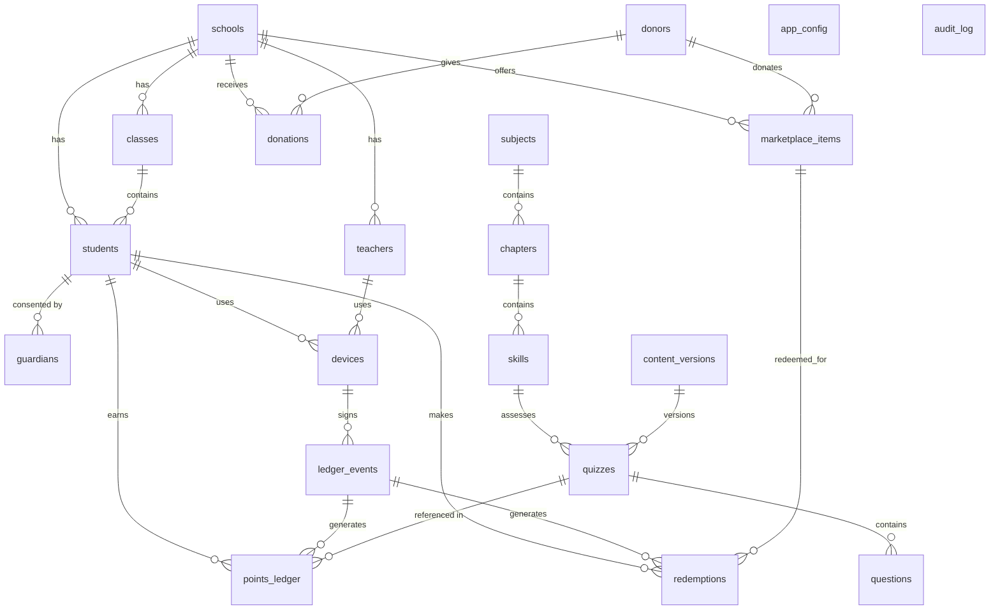

# Database Schema

Below is the Entity-Relationship diagram of the core tables for the `chalk` project.

```mermaid
erDiagram
    schools ||--o{ teachers : has
    schools ||--o{ classes : has
    schools ||--o{ students : has
    schools ||--o{ marketplace_items : offers
    schools ||--o{ donations : receives

    classes ||--o{ students : contains

    students ||--o{ guardians : "consented by"
    students ||--o{ devices : uses
    students ||--o{ points_ledger : earns
    students ||--o{ redemptions : makes

    teachers ||--o{ devices : uses

    devices ||--o{ ledger_events : signs

    ledger_events ||--o{ points_ledger : generates
    ledger_events ||--o{ redemptions : generates

    subjects ||--o{ chapters : contains
    chapters ||--o{ skills : contains
    skills ||--o{ quizzes : assesses
    quizzes ||--o{ questions : contains
    content_versions ||--o{ quizzes : versions

    quizzes ||--o{ points_ledger : "referenced in"

    donors ||--o{ marketplace_items : donates
    donors ||--o{ donations : gives

    marketplace_items ||--o{ redemptions : redeemed_for

    app_config
    audit_log
```
